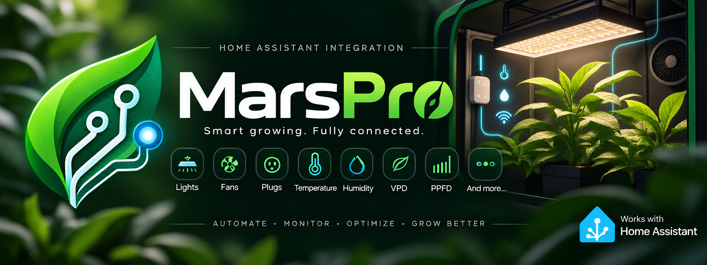

<p align="center">
  
</p>

# Mars Hydro — Home Assistant Integration

[](https://github.com/hacs/integration)
[](https://github.com/inzemix/ha-marspro/releases)
[](LICENSE)

Connect your Mars Hydro / Mars Pro devices (iHub Pro, iController, lamps, fans) to Home Assistant — sensors, switches, lights, and fans all discovered automatically.

> **Credit:** The Mars Pro cloud API foundation (REST login, MQTT topic scheme and broker authentication) was reverse-engineered by [iClint/MarsHydroAPIDocs](https://github.com/iClint/MarsHydroAPIDocs), verified there against a **Controller 43 (`MH-CB43`)**. This integration is built on top of that work. The **iHub Pro (`MH-IHUB10`)** protocol is *not* covered by that documentation — it was reverse-engineered separately for this project by observing the device's live MQTT traffic.

## Supported Devices

| Device | Product Type | Entities |
|---|---|---|
| **iHub Pro** | `MH-IHUB10` | T°, RH, VPD, power/energy, 10 outlets, 2 dimmers, fans |
| **iController Pro** | `MH-CB43` | T°, RH, VPD, PPFD, soil sensors, light, fan, blower, sockets |
| Grow lights (FC / TS series) | `MZU001` | ⚠️ **None of their own** — BLE-only devices that expose nothing through the cloud API. Their brightness is controlled through the iHub/iController dimmer port they are plugged into. |

Entities are only created for the two controller types listed above. Any other device type triggers a notification with a ready-to-send diagnostic report — see below.

## Adding support for another device

A controller that is not listed above can only be supported once its protocol has actually been observed — that is how iHub Pro support was added in the first place.

**You have nothing to install and nothing to run.** When the integration finds a device it does not support yet, it probes it once and shows a notification in Home Assistant with a link to the report:

1. It asks the device to describe itself — strictly read-only by default (`getDevSta`, `getSysSta`, `getConfigFile`). **Nothing is ever switched on or off.**
2. The report is written to `marspro_device_report.txt` in your Home Assistant configuration folder and served through a **private link that expires after 7 days**.
3. Send it to us in an issue and support can be added.

The report is built to avoid a long back and forth, so it also contains:

- the **actuators the device reports** (each one becomes a Home Assistant entity) and how they are driven (`setConfigField`);
- the **exact requests** that were sent, and which ones the device did **not** answer;
- a short **checklist of questions** about your setup to fill in.

**Please review the report before sending it**: it contains your device names, serial numbers and their raw state payloads (never your credentials).

You can also run it on demand: **Developer tools → Actions → `marspro.generate_device_report`**. It accepts an optional experimental *Test write commands* switch, which checks whether the device accepts commands by rewriting the values it just reported (nothing changes state) — leave it off unless we ask you to turn it on.

Note: a type already known to produce no entities (for example a grow light that only talks Bluetooth) is **not** probed automatically — opening a second connection to the vendor's broker for a device that already works in the Mars Pro app is not a risk worth taking. Use the action above if you want a report for such a device.

What the report answers is the key question: does the device answer on the cloud broker at all?

- **It answers** (like the iHub Pro): its data blocks become visible, and support can be added.
- **No reply** (like the FC series grow lights): the device is most likely Bluetooth-only. It talks to the Mars Pro app over BLE and exposes nothing through the cloud, so this integration cannot reach it.

`tools/discover_device.py` does the same from any computer (Windows, macOS, Linux) using **only the Python standard library — nothing to install**, handy when your Home Assistant is not reachable. Run it on a normal computer, **not** on your Home Assistant server: Home Assistant OS has no usable Python/pip environment.

```bash
python3 discover_device.py      # macOS / Linux
python discover_device.py       # Windows
```

Paste its output in a new issue.

## Installation

### Via HACS (recommended)

1. Open HACS → Integrations → ⋮ → Custom repositories
2. URL: `https://github.com/inzemix/ha-marspro`
3. Category: **Integration**
4. Install → Restart Home Assistant

### Manual

Copy `custom_components/marspro/` to `<config>/custom_components/marspro/`

## Setup

1. **Settings** → **Devices & Services** → **Add Integration** → **Mars Pro**
2. Enter your Mars Pro account **email** and **password**
3. The integration automatically discovers all your devices

## Features

- 🌡️ Live sensor data (temperature, humidity, VPD, power, energy)
- 💡 Light control with brightness (dimming over RJ12 / 0-10V)
- 🔌 Individual outlet switching (replaces Zigbee plugs!)
- 🌀 Fan speed control (inline blower, oscillating)
- 📊 Per-device configuration via `setConfigField`
- ⚠️ Low water / fault alarms
- 🔄 Automatic reconnection with exponential backoff
- 🩺 Automatic read-only diagnostic when an unsupported device is found, with a ready-to-send report

## Security

- Credentials stored encrypted by Home Assistant (config entry)
- MQTT connection uses TLS encryption
- Per-account ACLs enforced by Mars Hydro's broker
- **No personal data, keys, or tokens in this repository**

## FAQ

**Q: Does this work without the Mars Hydro cloud?**
A: No. Devices communicate through Mars Hydro's MQTT broker (`mars-pro.mqtt.lgledsolutions.com`). The firmware project [ihub-pro-open](https://github.com/thorstendjthb-glitch/ihub-pro-open) enables fully local control for iHub Pro.

**Q: My device doesn't appear in Home Assistant.**
A: Home Assistant shows a notification titled **"Mars Pro — unsupported device"** containing a link to a diagnostic report you can send us. The log also contains a line like:

```
Mars Pro: UNSUPPORTED device '<name>' (productType=<type>, serial=<serial>) — probing it now (read-only) so support can be added.
```

It tells you the exact device type found on your account. Entities are only created for `MH-IHUB10` and `MH-CB43`; other controllers (for example iConnect / iControl, which replaced the older Controller 43) were never reverse-engineered and therefore cannot be supported — see the credit note above for why. Also make sure the device is online and visible in the Mars Pro app first.

**Q: Can I control intensity/brightness?**
A: Yes, for lights connected via the RJ12 dimmer port (iHub Pro) or the CB43 light channel. Standard 230V outlets are on/off only.

## License

MIT © 2026 Xavier Clement
